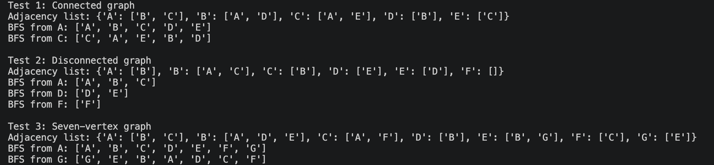

# Programming Assignment 6: Graph Representation and BFS Traversal

Name: Erica Cepeda  
Course: CS 5329

## Description

This project realizes the representation of an undirected graph via an adjacency list in Python. The functionality of the `Graph` class includes vertex addition, edge addition, and Breadth-First Search (BFS) starting from a chosen vertex. In BFS, a queue is used to visit nearby vertices before visiting distant vertices. The program demonstrates the traversal of both connected and disconnected graphs and the influence of a starting vertex on the order of the traversal.

## How to Run

Ensure that Python 3 is installed. Download or clone the repository, open a terminal in the repository folder, and run:

```bash
python3 graph_bfs.py
```

On systems where Python 3 is accessed through `python`, run:

```bash
python graph_bfs.py
```

The program prints each graph’s adjacency list and BFS traversal orders.

## Files

- `graph_bfs.py`: Graph implementation, BFS algorithm, and three test graphs
- `README.md`: Project overview, run instructions, and execution results
- `report.md`: Written explanations, test analysis, complexity analysis, BFS/DFS comparison, and reflection

## Test Cases
Test 1: Connected graph. Edges: A-B, A-C, B-D, C-E. Five vertices are connected. BFS starts from A and C. Both traversals visit all vertices in various order.

Test 2: Disconnected graph. Components: A-B-C and D-E; isolated vertex: F. BFS starts from A, D, and F. All traversals visit only the starting vertex’s component.

Test 3: Seven-vertex graph. Edges: A-B, A-C, B-D, B-E, C-F, E-G. BFS starts from A and G.

## Execution Evidence

The program worked correctly in Python 3. Screenshot below shows adjacency lists and the BFS results for all three tests.



The disconnected graph is used to prove that BFS traversal cannot automatically visit other components. The isolated vertex F leads to BFS traversal that contains only F.
